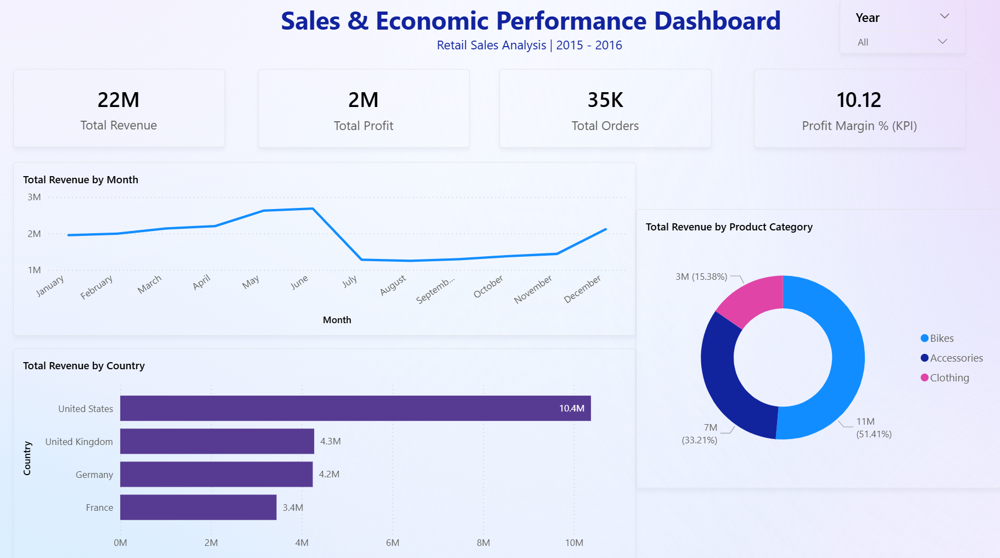
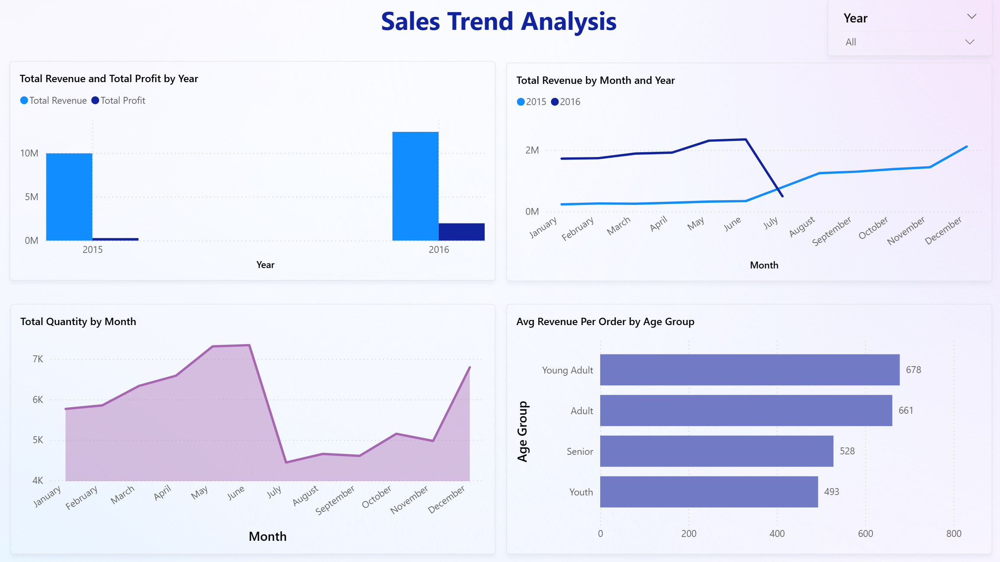
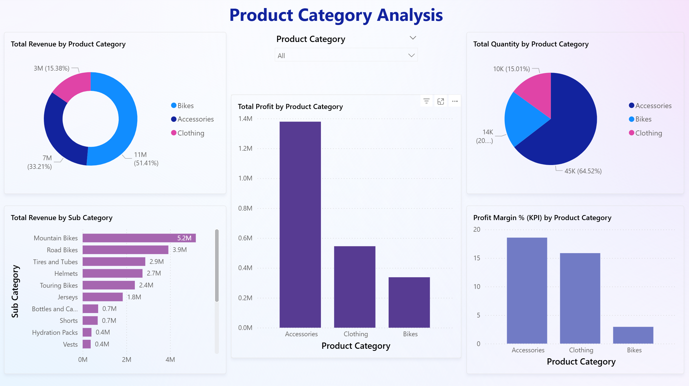
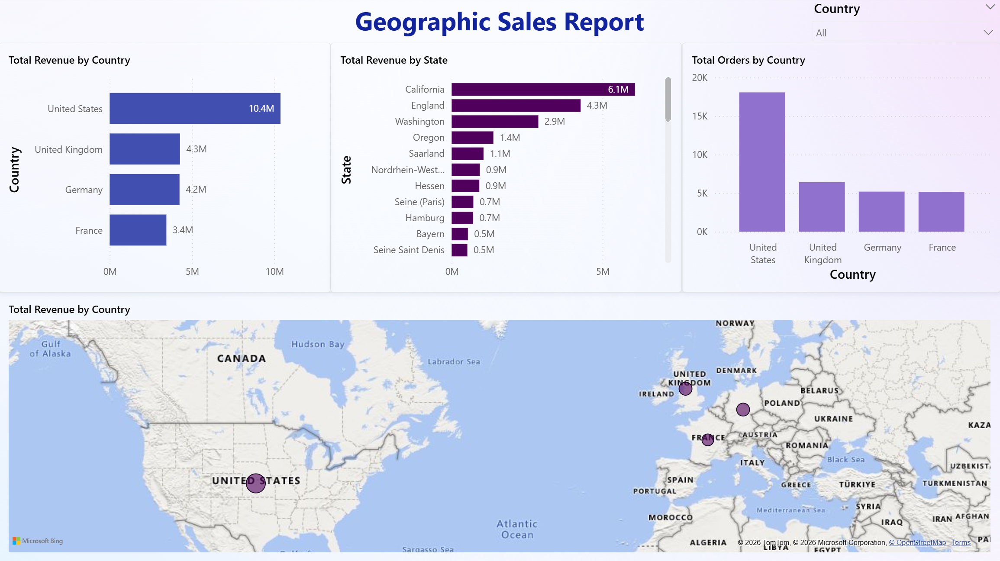
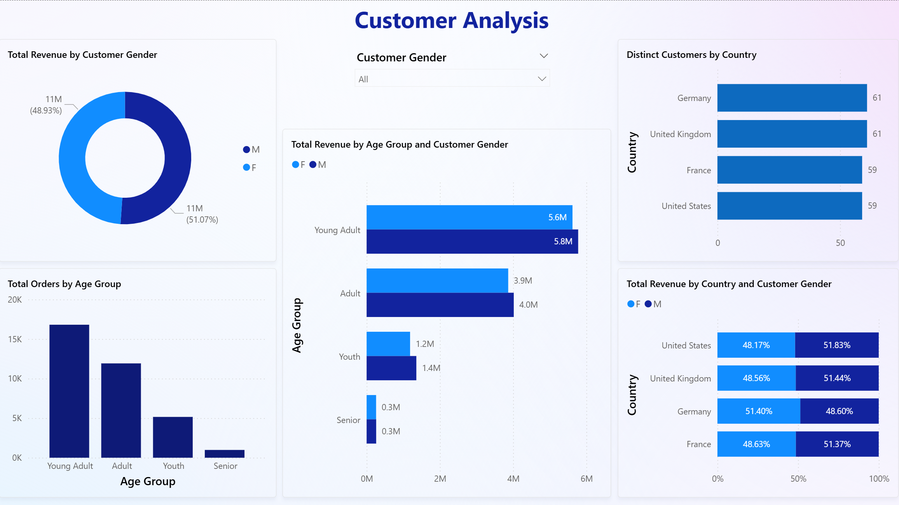

# SalesInsight — Power BI Sales & Economic Performance Dashboard

An end-to-end Business Intelligence project built using Microsoft Power BI on a real-world retail sales dataset. The project covers data cleaning, data modeling, DAX calculations, and the development of 5 interactive dashboards delivering actionable business insights.

---

## Project Overview

| Detail | Info |
|---|---|
| **Tool** | Microsoft Power BI |
| **Dataset** | Retail Sales Data — Kaggle |
| **Records** | 34,866 transactions |
| **Dashboards** | 5 interactive dashboards |
| **DAX Measures** | 10 custom measures |
| **Domain** | Retail Sales & Business Intelligence |

---

## Dataset

**Source:** [Sales Data for Economic Data Analysis — Kaggle](https://www.kaggle.com/datasets/abhishekrp1517/sales-data-for-economic-data-analysis)

**Columns:** Date, Year, Month, Customer Age, Customer Gender, Country, State, Product Category, Sub Category, Quantity, Unit Cost, Unit Price, Cost, Revenue

---

## Data Preprocessing (Power Query — 11 Steps)

| Step | Action |
|---|---|
| 1 | Removed junk column |
| 2 | Removed duplicate rows |
| 3 | Removed index column |
| 4 | Removed blank rows |
| 5 | Renamed Unit Cost → Cost Per Unit |
| 6 | Verified and corrected all data types |
| 7 | Added custom Profit column: `[Revenue] - [Cost]` |
| 8 | Added Age Group conditional column (Youth / Young Adult / Adult / Senior) |
| 9 | Added Profit Margin % column: `[Profit] / [Revenue] * 100` |
| 10 | Filtered out zero-revenue rows |
| 11 | Added Month Number column for correct chronological sorting |

---

## DAX Measures (10)

| Measure | Formula | Purpose |
|---|---|---|
| Total Revenue | `SUM(Revenue)` | Total revenue across all transactions |
| Total Cost | `SUM(Cost)` | Total cost across all transactions |
| Total Profit | `SUMX(table, Revenue - Cost)` | Row-by-row profit calculation |
| Total Orders | `COUNT(Revenue)` | Number of transactions |
| Avg Revenue Per Order | `AVERAGE(Revenue)` | Average revenue per transaction |
| Total Quantity | `SUM(Quantity)` | Total units sold |
| Profit Margin % (KPI) | `DIVIDE(Total Profit, Total Revenue, 0) * 100` | Overall profit margin |
| Max Revenue | `MAX(Revenue)` | Highest single transaction |
| Min Revenue | `MIN(Revenue)` | Lowest single transaction |
| Distinct Customers | `DISTINCTCOUNT(Customer Age)` | Unique customer age values |

---

## Dashboards

### Dashboard 1 — Overview
High-level summary of overall business performance.
- KPI Cards: Total Revenue (22M), Total Profit (2M), Total Orders (35K), Profit Margin % (10.12)
- Line Chart: Revenue by Month
- Bar Chart: Revenue by Country
- Donut Chart: Revenue by Product Category



### Dashboard 2 — Trend Analysis
Sales performance over time across years and months.
- Revenue and Profit comparison: 2015 vs 2016
- Monthly quantity sold trend
- Average Revenue Per Order by Age Group



### Dashboard 3 — Product Category Analysis
Profitability breakdown by product category and subcategory.
- Revenue, Profit, and Quantity by Category
- Revenue by Subcategory
- Profit Margin % by Category



### Dashboard 4 — Geographic Sales Report
Sales distribution across countries and states.
- Map Visual: Revenue by Country
- Top states by revenue
- Total orders by country



### Dashboard 5 — Customer Analysis
Customer demographics and buying behaviour.
- Revenue split by Gender
- Orders and Revenue by Age Group
- Revenue by Country and Gender



---

## Key Business Insights

- **Bikes dominate revenue** — contributing 51.41% of total revenue
- **United States is the top market** — accounting for 10.4M in revenue
- **Revenue peaks in June** — followed by a sharp drop in July
- **Young Adults (25–40) are the most valuable customers** — highest average revenue per order at 678
- **Gender split is nearly equal** — Male 51.07%, Female 48.93%
- **California is the top state** — contributing 6.1M, ~60% of total US revenue
- **2016 outperformed 2015** — indicating year-on-year business growth
- **Accessories have the highest profit margin** — despite lower revenue than Bikes

---

## Project Structure

```
SalesInsight-PowerBI-Dashboard/
│
├── Sales_Economic_Dashboard.pbix    # Power BI project file
├── retail_sales_data.csv            # Raw dataset
├── README.md                        # Project documentation
└── screenshots/
    ├── overview_dashboard.png
    ├── trend_analysis.png
    ├── category_analysis.png
    ├── geographic_report.png
    └── customer_analysis.png
```

---

## How to Open

1. Download and install [Microsoft Power BI Desktop](https://powerbi.microsoft.com/desktop/) (free)
2. Clone or download this repository
3. Open `Sales_Economic_Dashboard.pbix` in Power BI Desktop
4. All dashboards and data will load automatically

---

## Tools & Technologies

| Tool | Purpose |
|---|---|
| Microsoft Power BI | Dashboard development and visualisation |
| Power Query | Data cleaning and transformation |
| DAX | Calculated measures and KPIs |
| Excel/CSV | Raw data source |

---

## Author

**Anuska Ghosh**

[LinkedIn](https://linkedin.com/in/anuska-ghosh) | [GitHub](https://github.com/anuskaGHS)
